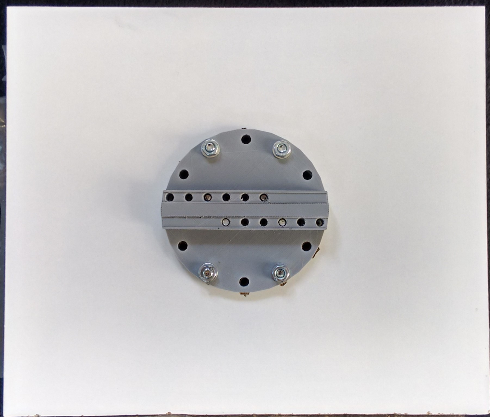
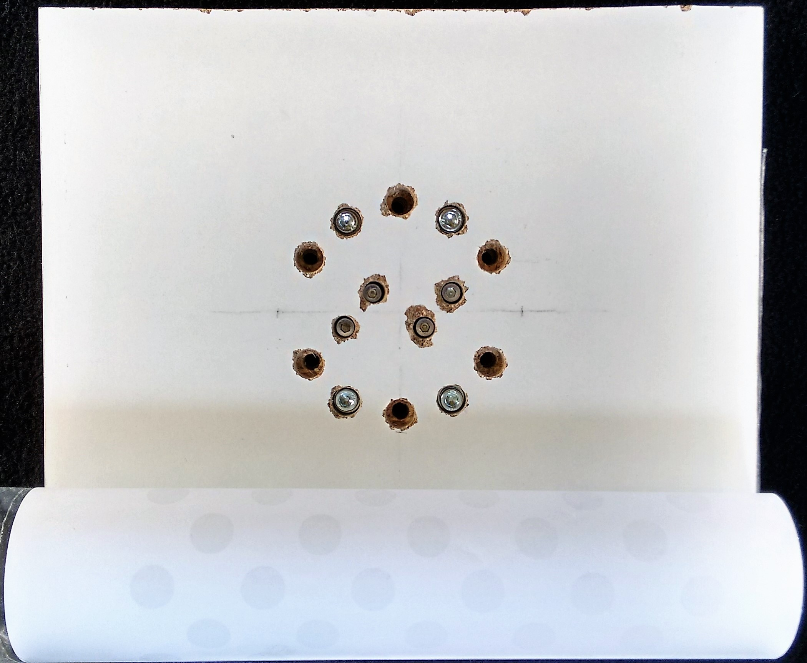
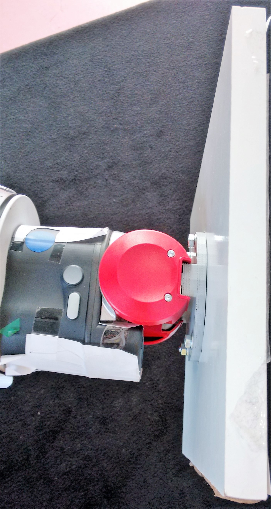
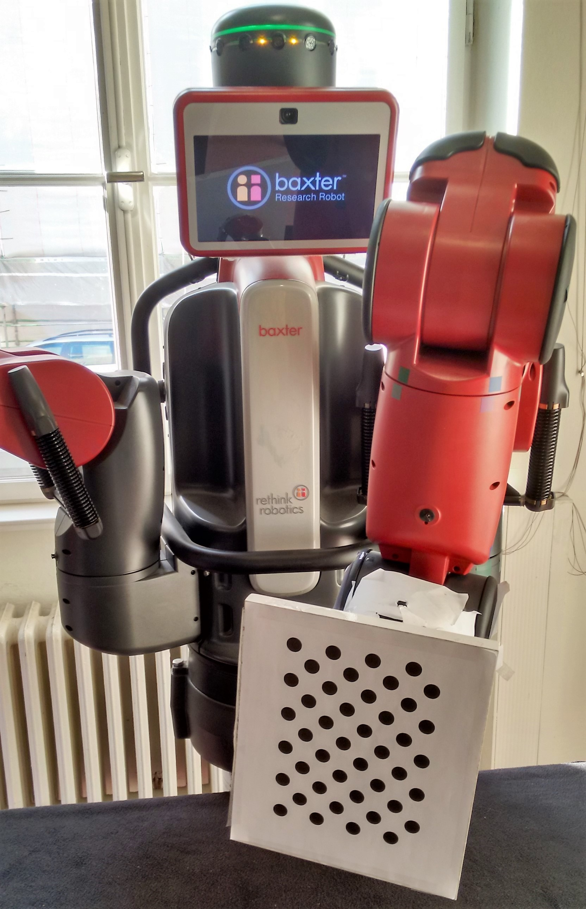

# Usage of the Human-Baxter Collaboration Framework

Let us introduce the usage of the Human-Baxter collaboration framework using the example of the distributed pick-and-place scenario.
For first-time usage, we need to
- download the pre-trained neural networks,
- perform the calibration routines and
- run the experiment.

Otherwise it is sufficient to 
- run the experiment.

Note that it might make sense to repeat some parts of the calibration every once in a while.


In the following, we assume that the Human-Baxter collaboration framework has been installed as described [here](../install.md) into a catkin workspace called `$WS_HBCF`.  


## Preliminaries


### Obtain pre-trained Caffe Model

To use R-FCN for object detection we first download the pre-trained weights for the Caffe model:
```bash
$ cd $WS_HBCF/data/ResNet-101
$ . fetch_rfcn.sh
```


### Kinect V2 Preliminaries


#### Kinect on Linux: Calibrate Kinect V2 Sensor

It is advisable that you calibrate your Kinect V2 once.
To do so, connect your sensor and run
```bash
$ cd $WS_HBCF/src/iai_kinect2
$ source /opt/ros/indigo/setup.bash
$ roslaunch kinect2_bridge kinect2_bridge.launch
```

Calibrate your sensor using the `kinect2_calibration`.
Follow the instructions [here](https://github.com/code-iai/iai_kinect2/tree/master/kinect2_calibration).
We obtained good results with the [*chess5x7x0.03* pattern](https://github.com/code-iai/iai_kinect2/blob/master/kinect2_calibration/patterns/chess5x7x0.03.pdf) and the guidelines laid out in Wiedemeyer's second comment [here](https://github.com/code-iai/iai_kinect2/issues/311).

Add the calibration files to the `kinect2_bridge/data/<serialnumber>` folder.
See [here](https://github.com/code-iai/iai_kinect2/tree/master/kinect2_bridge#first-steps) for further details.

Restart `kinect2_bridge` such that it uses the new calibration.


#### Kinect on Windows: Download the ELTE Kinect Windows tool

A pre-compiled executeable of the ELTE Kinect Windows tool (64 bit) can be downloaded from [here](https://drive.google.com/file/d/0BwnJXv4RfpRoZUhFTHlPMEdmQmc/view?usp=sharing).
The checksum of the tar archive is `970C056929E3FDAC2FD1F04ED40F0E89`.
Download it to the Windows machine your Kinect V2 sensor is connected to and extract the archive.
Run `KinectOverNetwork.exe` after plugging in your Kinect V2 sensor into an USB 3.0 port to start the server waiting for requests to send the latest color-, depth- or skeleton data over the network.


### Assemble the Hand Mount for the External Calibration
For the external calibration of the Kinect V2 sensor relative to the Baxter robot a hand-mounted calibration pattern is used.
The hand mount has been designed in [OpenSCAD](http://www.openscad.org/) to replace the fingers of the electrical gripper.
The original CAD file and the derived STL file can be found in `$WS_HBCF/models/mount`.

3D print the hand mount.
Additionally, you will need a flat piece of wood or acrylic glass of about 21 x 25 cm, a drill and some screws.

Print the [calibration pattern](http://docs.opencv.org/2.4.13/_downloads/acircles_pattern.png) and make sure that its dimensions are preserved by the printer.
When gluing the patten onto the mount (after it has been screwed to the hand of the robot), make sure that it is completely flat! 







### Adjust the Framework Settings

Some adjustments to the settings in `src/settings/settings.py` might be necessary:

- If you are using the Kinect on Windows, you need to set the IP or host name of the Windows machine the Kinect V2 sensor is connected to (variable `elte_kinect_win_host`).
- If you installed the R-FCN framework (cf. [step 5 of the installation instructions](https://github.com/BRML/baxter_pick_and_place/blob/master/install.md#step-5-install-this-package-and-its-dependencies)) in a directory different than the default one (i.e., into `~/software`), you need to adapt the variable `develop_dir` accordingly in order for Python being able to find the local Caffe version.


## Calibration

The calibration performed for the distributed pick-and-place scenario consists of three parts:

1. Estimate the table height in Baxter's base coordinates.
1. Obtain reference images of the (empty) table to find empty spots for placing objects.
1. Estimate the external calibration (the pose (= position and orientation) of the Kinect V2 sensor relative to Baxter's base coordinates). 

If you run `rosrun baxter_pick_and_place demonstration.py` the program will guide you through the first two calibration tasks (table height and table view).

If you run the experiment in simulation mode (see below), the external calibration basically comes for free.
Otherwise, an estimate for the external parameters can be obtained, e.g., using the algorithm by Tsai and Lenz (1989).
In this case, attach the previously prepared and assembled hand mounted calibration pattern to one of Baxter's limbs.
Plug in your Kinect V2 sensor and position it such that it has a clear view of Baxter and the task space.
In both cases, run
```bash
$ cd $WS_HBCF
$ . baxter.sh [sim]
$ rosrun baxter_pick_and_place calibrate_external.py
``` 
to perform the external calibration.

The three calibration routines will create files `table_height.npz`, `table_view.npz` and `external_parameters.npz` in `$WS_HBCF/data/setup`.
To repeat a calibration step (e.g., when lighting conditions change drastically (`table_view.npz`) or when switching from simulation to the real robot (`external_calibration.npz`)) manually delete the corresponding file and run the `calibrate_external.py` or `demonstration.py` script again.


## Run the Experiment

Using the Kinect sensor requires some preparation:
- If you are intending to use the Kinect V2 on Windows, make sure to plug it in and run the ELTE Kinect Windows tool on the Windows machine.
- If you want to use the Kinect V2 on Ubuntu using ROS, plug it into your Ubuntu machine and run the kinect2_bridge by typing
```bash
$ cd $WS_HBCF
$ . baxter.sh
$ rosrun kinect2_bridge kinect2_bridge
```
- If you are using the simulated Kinect, the launch script (see below) will take care of the details.


To follow the progress of the experiment visual information is published to a ROS image topic.
To show the visualization, type (in two terminals with initialized SDK environment) `rosrun baxter_pick_and_place inspection.py` and `rosrun image_view image_view image:=/visualization/image`.


### On the Robot

To run the pick-and-place experiment, initialize your SDK environment and `rosrun` the experiment.
That is, do
```bash
$ cd $WS_HBCF
$ . baxter.sh
$ rosrun baxter_pick_and_place demonstration.py
```
In a new terminal, run the instruction module
```bash
$ cd $WS_HBCF
$ . baxter.sh
$ rosrun baxter_pick_and_place instruct.py
```
and follow the instructions in the terminal.


### In Simulation

To start up the simulation environment (Gazebo) and run the demonstration, 
initialize your SDK environment in simulation mode, `roslaunch` the simulator
and `rosrun` the experiment.
That is, in a terminal do
```bash
$ cd $WS_HBCF
$ . baxter.sh sim
$ roslaunch baxter_pick_and_place simulation.launch depth_external:=true
```
In another terminal do
```bash
$ cd $WS_HBCF
$ . baxter.sh sim
$ rosrun baxter_pick_and_place demonstration.py
```
And in a third terminal run the instruction module by typing
```bash
$ cd $WS_HBCF
$ . baxter.sh sim
$ rosrun baxter_pick_and_place instruct.py
```
Now follow the instructions in the third terminal.

Note: The `roslaunch` files have parameters to modify their behavior. Please
have a look at the files for more information.


### Experiment Convenience Launch File

There also is a launch file that collects the separate steps above into
one file.
To [start up the simulation environment and] run the experiment, do
```bash
$ cd $WS_HBCF
$ . baxter.sh [sim]
$ roslaunch baxter_pick_and_place demonstration.launch [gazebo:=true] [record_vis:=true]
```
where the optional `gazebo` flag indicates whether the simulation environment needs to be started and `record_vis` records the visualization topic into a rosbag file and stores it in /tmp/pnp-vis*.
In another terminal run the instruction module by typing
```bash
$ cd $WS_HBCF
$ . baxter.sh [sim]
$ rosrun baxter_pick_and_place instruct.py
```
